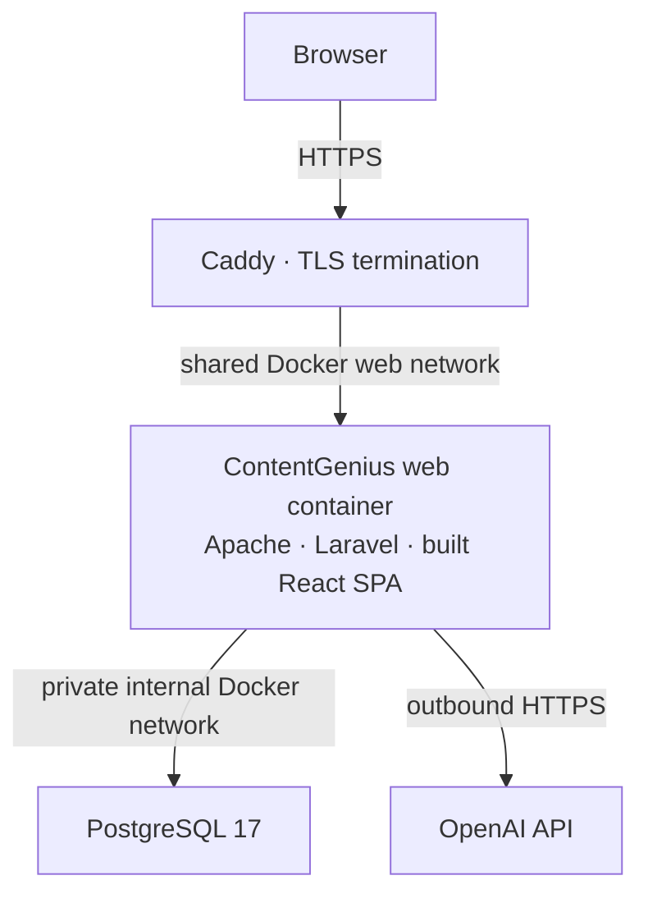

# ContentGenius

AI-powered multilingual SEO content generation built as a production-style portfolio project. ContentGenius combines a Laravel backend and React frontend with OpenAI integration, AI safety controls, provider usage accounting, analytics and a Dockerized deployment.

## Live demo

**[Open ContentGenius](https://contentgenius.hideas.dev)**

| Public account      | Email                                 | Password                      |
| ------------------- | ------------------------------------- | ----------------------------- |
| Content workflow    | `demo@contentgenius.hideas.dev`       | `ContentGeniusDemo!2026`      |
| Recruiter analytics | `admin-demo@contentgenius.hideas.dev` | `ContentGeniusAdminDemo!2026` |

The regular demo lets you create drafts and exercise Generate/Regenerate within the shared demo budgets. Recruiter analytics are read-only, with identifying user/content fields sanitized server-side. Private real-admin credentials are never published.

**Maintainer action:** replace the clearly marked recruiter password placeholder above with the intentionally public demo password before committing this README.

## Why this project

ContentGenius is an engineering portfolio project, rather than a commercial SaaS product. Its focus is the work surrounding an AI integration: owned content and language versions, validated output, failure-safe persistence, concurrency-safe reservations, measurable usage and a public analytics role that protects private data.

## Technology stack

| Area     | Stack                                                                       |
| -------- | --------------------------------------------------------------------------- |
| Backend  | PHP 8.4 production runtime, Laravel 12, Laravel Sanctum, OpenAI PHP client  |
| Frontend | React 19, Vite 8, i18next / react-i18next, Recharts                         |
| Data     | PostgreSQL 17 in production; SQLite for default local development and tests |
| Runtime  | Docker / Docker Compose, Apache, shared Caddy reverse proxy                 |
| Hosting  | Hetzner Cloud, Ubuntu 24.04 LTS, Let's Encrypt HTTPS, Cloudflare DNS        |
| Quality  | PHPUnit 11, Laravel Pint, ESLint, Node test runner                          |

## Features

**Content**

- English, Ukrainian and German UI and article generation; UI locale stays independent of article language.
- Grouped language versions with editable drafts and independent generation, regeneration and staleness tracking. Adding a language draft does not automatically translate existing text.
- Primary/secondary keywords, contextual links and SEO metadata guidance; structured article title, Markdown and generated meta fields are validated before saving.
- Server-side Markdown rendering escapes raw HTML and rejects unsafe link destinations.

**AI safety and cost control**

- Input moderation → generation → output moderation, with a purpose guard, bounded inputs and a hard output-token cap.
- Generate and Regenerate share a per-user rolling quota: **5 logical requests per hour** by default, across all article versions.
- Separate provider-call, input/output token and estimated USD cost accounting; missing usage is retained as unknown rather than invented.
- Database-serialized conservative reservations enforce configurable global daily/monthly limits before every paid provider operation. Rejections and generation failures preserve previous generated content.

The default generation model is **`gpt-4o-mini`**, configurable through `OPENAI_MODEL`. Demo defaults are:

| Global limit                          | Default   |
| ------------------------------------- | --------- |
| Estimated cost per UTC day            | $0.10     |
| Estimated cost per UTC calendar month | **$1.00** |
| Provider calls per UTC day            | 50        |
| Tokens per UTC day                    | 75,000    |

These budgets are shared across users. Generation can return HTTP 429 when a quota or budget is exhausted, with retry/reset information. The monthly ceiling is the authoritative application cost safeguard; costs are estimates based on configured prices, not provider invoices.

**Admin and observability**

- Today, current-month and all-time usage summaries, token/cost statistics and the latest 20 logical AI requests.
- Exactly two charts: a seven-day UTC call/token trend with separate axes, and all-time provider call counts for generation and both moderation stages.
- A private real-admin view and a separate, sanitized read-only recruiter analytics view.

**Production**

- Built React SPA and Laravel served from one PHP/Apache container, behind HTTPS.
- PostgreSQL on an isolated internal Docker network, with no database port published to the host.
- Persistent database/application-storage volumes, HTTP and database-container health checks, and runtime configuration/route caches.

## Architecture



React is compiled into the production web image. Apache and Laravel serve one public origin; Caddy terminates TLS. PostgreSQL is reachable only on the application's private internal network, and its port is not published to the host. The shared Caddy stack is managed separately from this repository.

## Generate / Regenerate flow

```text
Authenticated request → role, ownership and input validation → quota reservation
→ input moderation → generation → structured response validation
→ output moderation → transactional persistence
```

`AIRequest` represents one logical user generation request. `ProviderCall` records each provider operation separately: a successful pipeline normally makes three calls, including both moderation stages. Both classifications currently use paid Chat Completions. Before each operation, the application reserves budget under a database mutex; afterward it reconciles reported usage and estimated cost. Provider calls run outside database transactions, and reservation estimates are not reported as actual usage.

## Recruiter analytics role

The dedicated account has `is_admin_demo=true` and `is_admin=false`. Public credentials give access to analytics without granting content mutation rights: create, edit, delete, translation, Generate and Regenerate endpoints return **HTTP 403** before OpenAI client resolution.

Recent requests retain IDs, statuses, tokens and timestamps, but names and titles become `User #<id>` / `Content #<id>`, and emails are omitted. Real admins retain detailed data. This separation makes the shared analytics account useful for review without exposing private user/content fields or allowing paid AI calls.

## Testing and quality

The **current verified test suite** contains **379 backend tests / 3,357 assertions** and **73 frontend tests**. Coverage includes authentication/authorization, language versions, SEO contracts, safe rendering, moderation, failure preservation, quotas, concurrent budget reservations, UTC rollovers, accounting and recruiter-view privacy.

Local validation passed with:

```sh
composer validate
php artisan test
php vendor/bin/pint --test
npm --prefix frontend test
npm --prefix frontend run lint
npm --prefix frontend run build
git diff --check
```

Tests use provider fakes and do not require real OpenAI calls. GitHub Actions CI/CD, automated backups and dedicated monitoring are not implemented yet.

## Production deployment

The live deployment runs on a Hetzner Cloud VPS with Ubuntu 24.04 LTS and Docker Compose: a PHP 8.4 / Apache application container, PostgreSQL 17, and a shared Caddy reverse proxy providing Let's Encrypt HTTPS. Cloudflare provides DNS; persistent Docker volumes and a private database network are defined in the application Compose configuration.

See [Production Docker deployment](docs/production-docker.md) for the environment contract, explicit migrations and release verification. [Demo protection](docs/demo-protection.md) and [Recruiter admin demo](docs/recruiter-admin-demo.md) document the dedicated identities, safeguards and seeding procedures.

## Local development

Prerequisites: PHP 8.2+ with Laravel-required extensions and PDO SQLite, Composer 2, and Node.js 24 with npm. Production uses PHP 8.4 and PostgreSQL; the simplest local setup uses SQLite and two development servers.

From a fresh checkout:

```sh
composer install
npm --prefix frontend install
php -r "file_exists('.env') || copy('.env.example', '.env');"
php -r "file_exists('database/database.sqlite') || touch('database/database.sqlite');"
```

In your local `.env`, set:

```dotenv
APP_URL=http://localhost:8000
FRONTEND_URL=http://localhost:5173
SANCTUM_STATEFUL_DOMAINS=localhost:5173,localhost:8000
SESSION_DOMAIN=null
SESSION_SECURE_COOKIE=false
```

The template defaults to SQLite and database-backed sessions/cache. Then initialize the fresh local application:

```sh
php artisan key:generate
php artisan config:clear
php artisan migrate
php artisan db:seed --class=DemoUserSeeder
```

Start each server in a separate terminal:

```sh
php artisan serve --host=localhost --port=8000
npm --prefix frontend run dev -- --host localhost --port 5173 --strictPort
```

Open `http://localhost:5173`. The default **local** demo is `demo@contentgenius.example` / `ContentGeniusDemo!2026`; the live demo email differs. For local recruiter analytics, configure `ADMIN_DEMO_EMAIL` / `ADMIN_DEMO_PASSWORD` and explicitly run `php artisan db:seed --class=AdminDemoUserSeeder`.

Drafts, authentication and tests work without a provider key. To exercise real generation locally, supply your own OpenAI key through local environment configuration; paid usage remains subject to the configured budgets. Never commit populated environment files. Run the checks above from the repository root. On Windows PowerShell, use `npm.cmd` if the execution policy blocks `npm.ps1`.

## Documentation

- [Production Docker deployment](docs/production-docker.md) — image, networks, environment and release operations.
- [Demo access and generation protection](docs/demo-protection.md) — public demo setup, quotas and bounded inputs.
- [Recruiter admin demo](docs/recruiter-admin-demo.md) — read-only permissions, sanitized analytics and seeding.
- [AI usage and cost protection](docs/ai-usage.md) — provider ledger, pricing assumptions and reservation accounting.
- [SEO article generation](docs/seo-articles.md) — input/output contract and safe Markdown presentation.
- [Content language versions](docs/content-language-versions.md) — grouped drafts and language ownership rules.
- [Moderation](docs/moderation.md) — classification policy and failure handling.

## Author

Built and maintained by **Viacheslav Huliaiev**, Senior PHP / Web Engineer.

Focus: Laravel, WordPress/PHP, React, AI integrations, high-traffic web platforms, technical SEO, performance and reliability.
